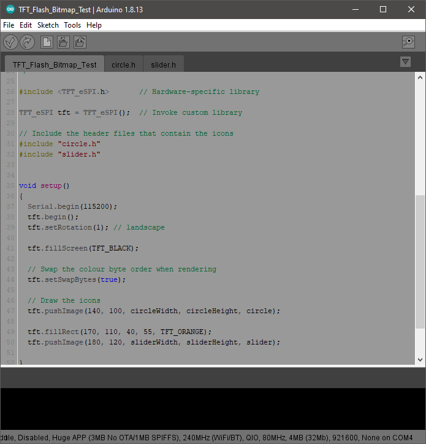

# Arduino-Gray-Theme

A gray theme for the arduion IDE.

I usually work on arduino projects at the end of my day and the default IDE theme is just too harsh on my eyes during late night coding sessions. I tried a few of the available 'dark' themes and while they are dark, they are just too colorful and not much better than the default theme, IMO. So I've created a new gray theme for the arduino IDE:

I actually did not create this color scheme, I copied it from blender 3d's text editor.

There is one problem with this theme, and I can't change it. The line #'s and background are close to the same color and hard to read. The background color is the same color as the text editor, and the font color of the numbers can't be changed. That is this theme's downfall.....

# Installation:

## IDE v 1.8.6 and newer:
- Find your sketchbook folder: File -> Preferences -> Sketchbook location
- Open the Sketchbook directory/folder and create a new directory called 'theme'
- Downlocad 'theme-gray.zip' and move the downloaded .zip file to this new 'theme' directory
- Restart the arduino IDE
- In arduino IDE select: File -> Preferences -> Theme and select the new theme
- Restart the arduino IDE to use the new theme

